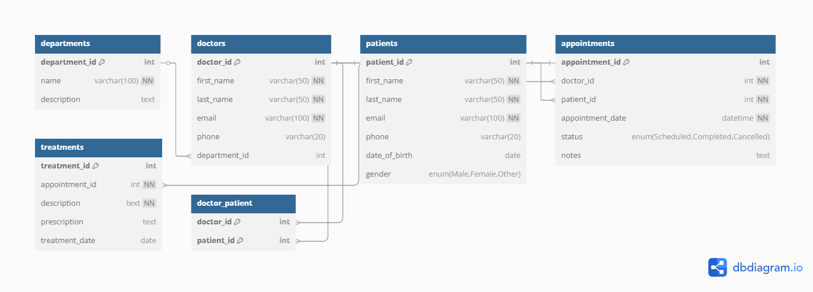

# ✅ Clinic Booking System: Overview

## 💡 Use Case
Manage appointments, doctors, patients, departments, and treatments in a healthcare clinic.

---

## 📊 Entities & Relationships (ERD Overview)

### Main Tables:
- **Patients** 👩‍⚕️
- **Doctors** 👨‍⚕️
- **Departments** 🏥
- **Appointments** 📅
- **Treatments** 💊
- **Doctor_Patient** (for Many-to-Many relation)

---

### 🧱 Relationships:
- A **doctor** belongs to **one department** (M:1).
- A **patient** can have **many appointments** (1:M).
- An **appointment** is linked to **one doctor** and **one patient**.
- A **treatment** is linked to an **appointment**.
- A **doctor** may treat **many patients**, and a **patient** may be treated by **many doctors** → **Many-to-Many**.

---

## ⚙️ Setup Instructions
1. Run the SQL file in **MySQL Workbench** or via the **CLI**.

---

## 📷 ERD Screenshot
